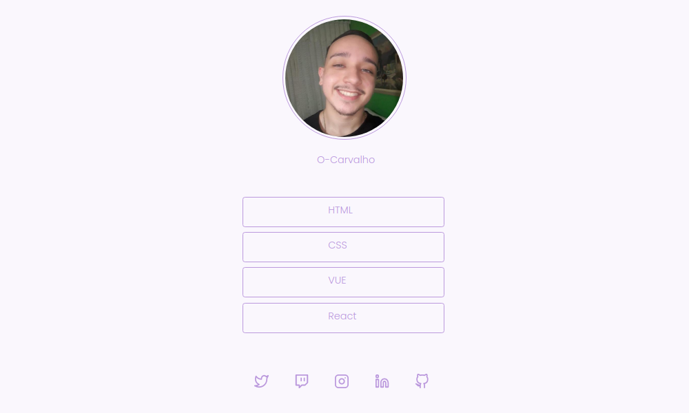
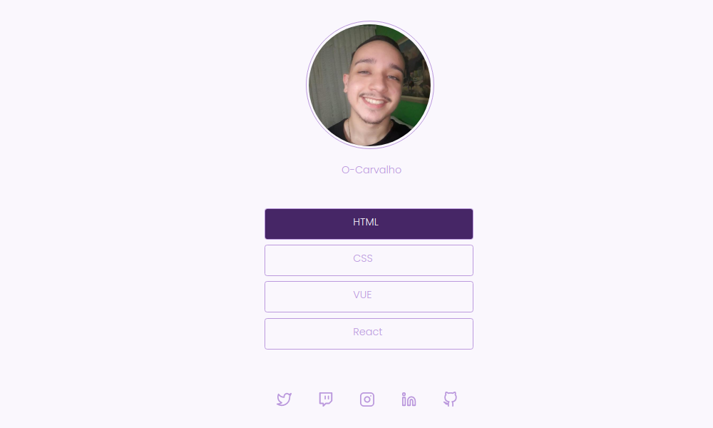

<H1 align="center"> </H1>

 

    
    

<a href="#sobre-o-projeto">Sobre o Projeto</a>&nbsp;&nbsp;|&nbsp;&nbsp;
<a href="#tecnologias">Tecnologias</a>&nbsp;&nbsp;|&nbsp;&nbsp;
<a href="#licença">Licença</a>

 

## Sobre o Projeto
Uma página desenvolvida em HTML e CSS que contem uma lista de links (menu) que pode ser usada em perfis de rede sociais para direcionar o usuário ao local escolhido.
  
 
  

 

## Tecnologias

- [HTML 5](https://www.w3schools.com/html/)
- [CSS 3](https://www.w3schools.com/css/)

## Licença

Esse projeto está sob a licença MIT. Veja o arquivo [LICENSE](/LICENSE) para mais detalhes.

 